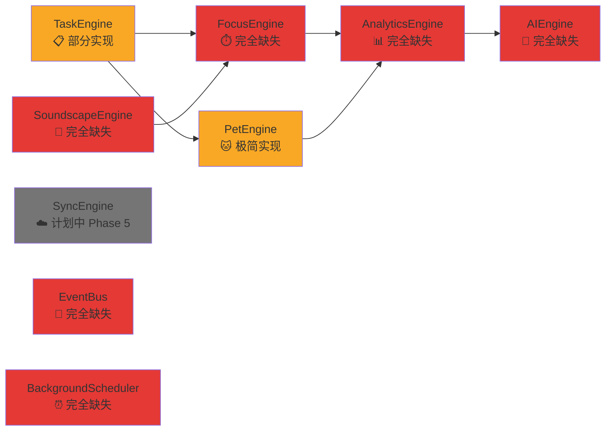
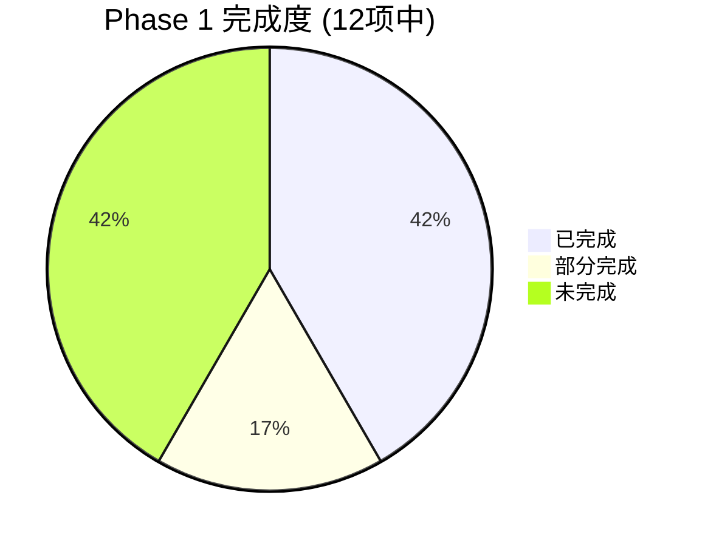

# WorkMemory-v3 项目分析报告

## 概述

本报告对比了 11 份设计文档与实际已开发的代码，系统性地列出：
1. **未实现的功能**（按优先级分类）
2. **已发现的 Bug 和问题**
3. **优化建议**

---

## 一、当前实现状态总览

### ✅ 已实现
| 功能 | 状态 | 备注 |
|------|------|------|
| 项目脚手架 (Tauri + React + TS) | ✅ 完成 | 基础结构完整 |
| SQLite 数据库初始化 | ✅ 完成 | 3 张表: tasks, pet_state, daily_stats |
| Task CRUD 后端命令 | ✅ 完成 | 8 个 Tauri 命令已注册 |
| 基础任务列表视图 | ✅ 完成 | 带状态过滤 |
| 任务卡片展示 | ✅ 完成 | 显示标题、描述、优先级、状态、标签 |
| 任务表单（新建/编辑） | ✅ 完成 | 模态框形式 |
| 宠物基础状态管理 | ✅ 完成 | Zustand store + 数据库持久化 |
| 底部导航栏 | ✅ 部分 | 仅 3 个 Tab（文档要求 5 个） |
| 宠物页面（基础） | ✅ 完成 | 喂食/玩耍/休息交互 |
| 历史统计页面（基础） | ✅ 完成 | 3 个统计卡 + 已完成任务列表 |
| 暗色主题 | ✅ 完成 | 自定义 CSS 变量 |

### ❌ 未实现
| 功能 | 路线图阶段 | 重要性 |
|------|-----------|--------|
| 仪表盘/首页 | Phase 1 | 🔴 高 |
| 快速添加任务 FAB | Phase 1 | 🔴 高 |
| 任务状态转换动画 | Phase 1 | 🟡 中 |
| 基础宠物帧动画 | Phase 1 | 🔴 高 |
| 5 Tab 导航 (Home/Tasks/Focus/Pet/Settings) | Phase 1 | 🔴 高 |
| 分类与标签管理 | Phase 1 | 🟡 中 |
| 数据启动时从 SQLite 加载 | Phase 1 | 🔴 高 |
| 番茄钟计时器 | Phase 2 | 🔴 高 |
| 自由计时器 | Phase 2 | 🟡 中 |
| 专注会话数据模型 | Phase 2 | 🔴 高 |
| 音景引擎 | Phase 2 | 🟡 中 |
| 宠物状态衍生计算 | Phase 2 | 🔴 高 |
| 宠物属性衰减 | Phase 2 | 🟡 中 |
| 连续天数追踪 | Phase 2 | 🟡 中 |
| 每日总结自动生成 | Phase 3 | 🟡 中 |
| 周报生成 | Phase 3 | 🟡 中 |
| 连续打卡日历 | Phase 3 | 🟡 中 |
| 心情标签 | Phase 3 | 🟡 中 |
| 分析图表 | Phase 3 | 🟡 中 |
| AI 集成 | Phase 3 | 🟢 低 |
| 成就系统 | Phase 4 | 🟢 低 |
| 宠物换装/外观 | Phase 4 | 🟢 低 |
| 升级动画 | Phase 4 | 🟢 低 |
| 多种宠物物种 | Phase 4 | 🟢 低 |
| 拖拽排序任务 | Phase 4 | 🟢 低 |
| 滑动手势 | Phase 4 | 🟢 低 |
| 设置页面 | Phase 4 | 🟡 中 |
| 数据导入/导出 | Phase 4 | 🟡 中 |
| 通知系统 | Phase 4 | 🟡 中 |
| 无障碍支持 | Phase 4 | 🟡 中 |
| 引导流程 | Phase 4 | 🟢 低 |

---

## 二、已发现的 Bug 和问题

### 🔴 严重问题

#### BUG-001: 应用启动时不从数据库加载数据
> [!CAUTION]
> 前端没有在应用启动时调用 Tauri 命令加载已保存的数据。`tasks`、`petState`、`dailyStats` 全部使用硬编码默认值初始化。每次重启应用，用户看到的都是空白状态。

**影响文件**: [App.tsx](workmemory-app/src/App.tsx)  
**验收标准冲突**: AC-008（数据持久化）

**修复方案**: 在 `App.tsx` 的 `useEffect` 中调用 `get_all_tasks`、`get_pet_state`、`get_daily_stats` 并更新 Zustand store。

---

#### BUG-002: 任务创建后未正确持久化到数据库
> [!WARNING]
> [TaskForm.tsx](/workmemory-app/src/components/TaskForm.tsx) 中 `execute("save_task", { task: ... })` 的调用存在问题：
> 1. `save_task` 命令期望接收 `Task` 类型参数，但前端传递的参数名为 `task`（小写），Tauri v2 的命令参数需要精确匹配
> 2. 创建任务使用 `Date.now().toString()` 作为 ID，而文档要求使用 UUID v4
> 3. `save_task` 的 catch 错误被静默吞掉（仅 console.error），用户无法感知保存失败

---

#### BUG-003: 任务状态更新和删除未持久化
> [!WARNING]
> [TaskCard.tsx](/workmemory-app/src/components/TaskCard.tsx) 中：
> - 点击状态徽章循环状态时，只调用了 Zustand 的 `updateTask`，**没有调用 Tauri 的 `update_task` 命令**
> - 删除任务只调用了 Zustand 的 `deleteTask`，**没有调用 Tauri 的 `delete_task` 命令**
> - 这意味着所有状态更新和删除操作在应用重启后丢失

---

#### BUG-004: 宠物状态未持久化
> [!WARNING]
> [PetView.tsx](/workmemory-app/src/views/PetView.tsx) 中所有宠物交互（喂食、玩耍、休息）只更新了 Zustand store，**没有调用 `save_pet_state` 命令**。宠物状态在重启后重置。

---

#### BUG-005: 每日统计数据从未更新
> [!CAUTION]
> `dailyStats` 使用默认值初始化后，**没有任何地方会更新它**。完成任务时不会递增 `tasks_completed`，没有任何专注计时器所以 `total_focus_time` 永远为 0，`streak_count` 也从不计算。整个统计页面展示的都是假数据。

---

### 🟡 中等问题

#### BUG-006: 数据模型与文档不一致

| 字段/实体 | 文档要求 | 实际实现 | 影响 |
|-----------|---------|---------|------|
| Task.status | `inbox`, `todo`, `in_progress`, `completed`, `archived` | `pending`, `in_progress`, `completed` | 缺少 inbox 和 archived 状态 |
| Task.priority | `none`, `low`, `medium`, `high`, `urgent` | `low`, `medium`, `high` | 缺少 none 和 urgent |
| Task.due_date | 必需字段 | 未实现 | 无法设置截止日期 |
| Task.mood_tag | 情绪标签 | 未实现 | 核心差异化功能缺失 |
| Task.recurrence_rule | iCal RRULE | 未实现 | 无法设置重复任务 |
| Task.is_pinned | 置顶任务 | 未实现 | 仪表盘需要 |
| Task.sort_order | 排序序号 | 未实现 | 无法自定义排序 |
| Task.subtasks | 子任务清单 | 未实现 | 任务详情缺失 |
| PetState.species | 宠物种类 | 未实现 | 只有默认"小助手" |
| PetState.cleanliness | 清洁度 | 未实现 | 缺少清洁交互 |
| PetState.bond_level | 亲密度 | 未实现 | 长期关系度量缺失 |
| PetState.mood | 7 种心情 | 4 种心情 | 缺少 ecstatic, content, angry |
| Category 表 | 独立实体 | 纯文本字段 | 无法统一管理分类 |
| Tag 表 | 独立实体 + 关联表 | 数组字段 | 无法跨任务管理标签 |
| FocusSession 表 | 专注会话记录 | **完全缺失** | 核心功能缺失 |
| UserPreferences 表 | 用户偏好设置 | **完全缺失** | 无法自定义设置 |
| Achievement 表 | 成就系统 | **完全缺失** | Phase 4 功能 |
| SoundscapePack 表 | 音景包 | **完全缺失** | Phase 2 功能 |
| DailyDigest 表 | 每日摘要 | 简化为 daily_stats | 缺少 AI 摘要等字段 |
| WeeklyReport 表 | 周报 | **完全缺失** | Phase 3 功能 |
| PetInteractionLog 表 | 互动日志 | **完全缺失** | 无法追踪互动历史 |

---

#### BUG-007: 宠物动画资源未被使用
> [!IMPORTANT]
> `pet/` 目录包含 9 组共 360 帧 PNG 动画资源（idle、walk、happy、sad、sleep、work、eat、wave、levelup），但前端完全使用 **emoji** 来表示宠物（😊😐😢🤩），这些精心制作的动画帧完全没有被集成。

---

#### BUG-008: 任务状态循环逻辑不正确
文档要求的状态转换流是单向的：`inbox → todo → in_progress → completed`，且不允许已归档任务转换状态。当前实现中 `pending → in_progress → completed` 是循环的（completed 后回到 pending），这违反了文档设计。

---

#### BUG-009: 删除任务没有确认对话框
验收标准 AC-003 明确要求：删除前弹出确认对话框 + 提供 5 秒撤销 toast。当前实现直接删除，没有任何确认。

---

#### BUG-010: CSP 安全策略被禁用
[tauri.conf.json](/workmemory-app/src-tauri/tauri.conf.json) 中 `"csp": null` 完全禁用了内容安全策略，存在安全风险。

---

### 🟢 轻微问题

#### BUG-011: 嵌套的 src-tauri 目录
`src/src-tauri/` 下存在一个重复的 Tauri 骨架代码目录（包含独立的 `Cargo.toml`、`lib.rs`、`tauri.conf.json`），应当删除以避免混淆。

#### BUG-012: 宠物经验值升级公式不一致
- **文档**: `XP_needed = level * 100 + (level - 1) * 50`
- **代码**: `XP_needed = level * 100`
- Level 5 时：文档需要 700 XP，代码只需 500 XP

#### BUG-013: 没有错误处理/用户反馈机制
- Rust 端所有错误转为 `String`，无结构化错误类型
- 前端没有 Error Boundary
- 没有 Toast/Snackbar 通知组件
- 用户感知不到操作失败

#### BUG-014: 任务 ID 生成方式不安全
使用 `Date.now().toString()` 生成任务 ID，在快速连续创建时可能产生重复 ID。后端已引入 `uuid` crate 但前端未使用。

---

## 三、UI/设计 与文档规范的差距

### 颜色系统偏差

| 设计系统 | 文档规范 | 实际实现 |
|----------|---------|---------|
| 主背景色 | `#0a0e27` (深海军蓝) | `#1a1a2e` |
| 强调色 | `#7c3aed` (电紫) | `#e94560` (红色) |
| 二级强调色 | `#06b6d4` (青色) | 无 |
| 字体 | Inter + JetBrains Mono | 系统字体栈 |
| 玻璃态效果 | `backdrop-filter: blur` | 无 |
| 动画风格 | Spring-based, 200-400ms | 仅基础 CSS transition |

### 缺失的 UI 组件

- ❌ FAB（悬浮操作按钮）
- ❌ 圆形倒计时计时器 (FocusTimerRing)
- ❌ 帧动画宠物头像 (PetAvatar)
- ❌ 渐变进度条 (StatBar with gradient)
- ❌ 情绪徽章 (MoodBadge)
- ❌ 成就卡片 (AchievementCard)
- ❌ 音景混合器 (SoundscapeMixer)
- ❌ 连续打卡日历 (StreakCalendar)
- ❌ AI 见解卡片 (AIInsightCard)
- ❌ Toast/Snackbar 通知
- ❌ 问候语（时间感知）
- ❌ 任务滑动手势
- ❌ 拖拽排序

---

## 四、架构层面的缺失

### 文档定义的核心引擎 vs 实现状态



| 引擎 | 状态 | 说明 |
|------|------|------|
| TaskEngine | 🟡 部分 | 有基础 CRUD，缺验证、状态守卫、全文搜索(FTS5)、批量操作、重复任务 |
| FocusEngine | 🔴 缺失 | 番茄钟、自由计时、会话管理、中断追踪 — 全部未实现 |
| PetEngine | 🟡 极简 | 仅前端交互，无衍生计算、无衰减函数、无动画状态机 |
| AnalyticsEngine | 🔴 缺失 | 每日摘要、周报、连续天数计算、生产力评分 — 全部未实现 |
| AIEngine | 🔴 缺失 | 本地 LLM 集成、提示词模板 — 全部未实现 |
| SoundscapeEngine | 🔴 缺失 | 音频包加载、多层混合 — 全部未实现 |
| EventBus | 🔴 缺失 | 模块间通信机制未实现 |
| BackgroundScheduler | 🔴 缺失 | 定时任务（宠物衰减、每日摘要） — 未实现 |

---

## 五、优化建议

### 🔴 立即需要修复 (Phase 1 完成所需)

#### 1. 实现数据启动加载
```typescript
// App.tsx 中添加
useEffect(() => {
  const loadData = async () => {
    const tasks = await invoke<Task[]>("get_all_tasks");
    setTasks(tasks);
    const pet = await invoke<PetState | null>("get_pet_state");
    if (pet) setPetState(pet);
    const today = new Date().toISOString().split("T")[0];
    const stats = await invoke<DailyStats | null>("get_daily_stats", { date: today });
    if (stats) setDailyStats(stats);
  };
  loadData();
}, []);
```

#### 2. 修复所有数据持久化断裂
- TaskCard 的状态更新和删除需调用 Tauri 命令
- PetView 的交互需调用 `save_pet_state`
- 每次任务完成需更新 `daily_stats`

#### 3. 使用 UUID v4 生成任务 ID
后端已有 `uuid` crate，在后端生成 ID 或前端引入 `uuid` 库。

#### 4. 添加删除确认对话框
实现简单的确认弹窗组件，符合验收标准 AC-003。

---

### 🟡 建议优化

#### 5. 集成宠物帧动画
360 帧 PNG 资源已就绪，建议：
- 将 `pet/` 目录复制到 `src-tauri/resources/` 或 `public/` 中
- 创建 `SpriteAnimator` 组件，使用 `requestAnimationFrame` 播放帧序列
- 实现动画状态机：idle↔walk↔happy↔sad↔sleep↔work↔eat↔wave↔levelup

#### 6. 扩展导航为 5 Tab
```
Home(仪表盘) | Tasks(任务) | Focus(专注) | Pet(宠物) | Settings(设置)
```

#### 7. 实现仪表盘首页
- 时间感知问候语
- 宠物小组件（可点击进入宠物页）
- 今日统计条
- 置顶任务
- 最近任务

#### 8. 实现番茄钟计时器
这是 Phase 2 的核心功能，但属于产品的差异化特征之一。建议优先开发。

#### 9. 升级设计系统
- 引入 Inter 和 JetBrains Mono 字体
- 调整色系为文档规范的紫色调
- 添加 glassmorphism 效果
- 升级动画为 spring-based

#### 10. 添加错误处理体系
- Rust 端：定义 `AppError` 枚举
- 前端：添加 React Error Boundary
- 添加 Toast/Snackbar 通知组件
- 操作反馈（成功/失败提示）

#### 11. 数据库优化
- 添加索引：`tasks(status)`、`tasks(priority)`、`tasks(category)`、`daily_stats(date)`
- 启用 WAL 模式 (`PRAGMA journal_mode=WAL`)，防止崩溃数据丢失
- 考虑添加 FTS5 全文搜索虚拟表

#### 12. 添加宠物状态衍生引擎
当前宠物状态是独立于用户行为的"手动操作"模式。应按文档设计：
- 完成任务 → 自动 +XP、+hunger
- 专注会话 → 自动 +XP、+energy
- 时间流逝 → 自动衰减 hunger(-5%/hr)、energy(-3%/hr)

#### 13. 实现 EventBus 模式
用于模块间通信，例如：
- `TaskCompleted` → PetEngine 处理 XP/mood → AnalyticsEngine 更新统计
- 降低模块间耦合度

#### 14. CSP 安全策略
配置合理的 CSP 策略，至少限制 `script-src` 和 `style-src`。

---

### 🟢 长期优化

#### 15. 性能优化
- 任务列表虚拟滚动（数据量大时）
- 宠物动画使用 Canvas 或 WebGL 渲染而非 DOM
- 数据库查询分页
- 懒加载音景资源

#### 16. 测试体系
- 当前 **零测试**（前端和后端都没有测试文件）
- 建议：Rust 端单元测试 + Vitest 前端测试 + Playwright E2E

#### 17. 无障碍支持 (WCAG 2.1 AA)
- 所有交互元素添加 `aria-label`
- 键盘导航支持
- `prefers-reduced-motion` 媒体查询
- 高对比度主题
- 触摸目标 ≥ 44×44px

#### 18. 国际化 (i18n)
当前所有文本硬编码为中文，建议抽取为语言包以支持未来多语言。

#### 19. 清理重复目录
删除 `src/src-tauri/` 嵌套目录，避免与真正的 `src-tauri/` 混淆。

---

## 六、总结

### 完成度评估



| 维度 | 评分 | 说明 |
|------|------|------|
| **功能完成度** | ⭐⭐ (2/5) | 仅完成基础 CRUD 和简单展示，核心功能缺失 |
| **数据持久化** | ⭐ (1/5) | 后端已实现，但前端未正确调用，实质无效 |
| **UI 还原度** | ⭐⭐ (2/5) | 基础布局可用，但与设计规范差距较大 |
| **代码质量** | ⭐⭐⭐ (3/5) | 结构清晰，但缺少验证、错误处理和测试 |
| **用户体验** | ⭐⭐ (2/5) | 可操作但缺少动画、反馈和引导 |

### 最紧急的 5 件事
1. 🔴 **修复数据持久化** — 启动时加载数据 + 所有操作写入数据库
2. 🔴 **集成宠物帧动画** — 360 帧资源已就绪，替换 emoji
3. 🔴 **扩展为 5 Tab 导航** — 添加 Home 和 Settings 页面
4. 🔴 **实现仪表盘首页** — 产品入口和核心体验
5. 🟡 **实现番茄钟计时器** — 产品核心差异化功能
